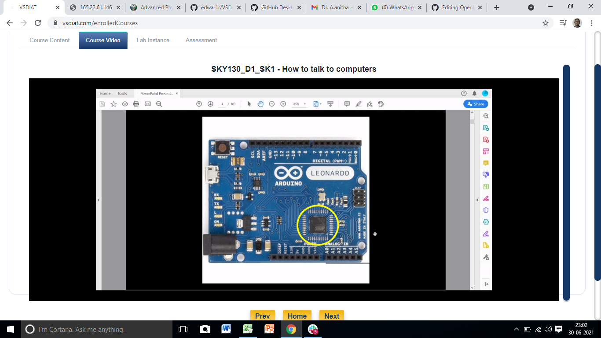
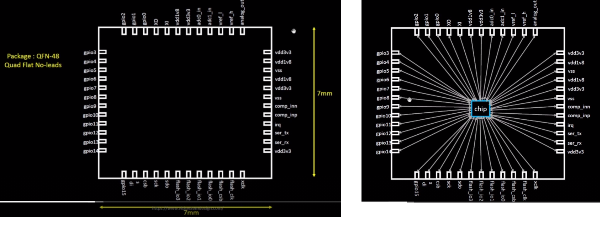

Advanced Physical Design - OpenLANE Workshop

Contents

+ #### [Day 1 - Inception of Opensource EDA](https://github.com/Anitha-Juliette/Openlane#Day1-Inception_of_Opensource_EDA)
    +  ##### [Talk with Computers](https://github.com/Anitha-Juliette/Openlane#Talk_with_Computers)
    +  ##### 

### Day 1 - Inception of Opensource EDA
#### I. TALK WITH COMPUTERS
**_1. Chip Overview_**
* Chip on a board with its Peripherals

* Package and Chip inside Package

* Deep inside the Chip

**_RISC_V Architecture_**
* C program -->converted to RISC-V assembly language program --> converted to machine language(binary) code --> run on RISC architecture(layout)
* Inbetween the RISC-V architecture specifications and Layout, RTL is sandwiched
* RTL implements the RISC-V architecture specifications and generates Layout

