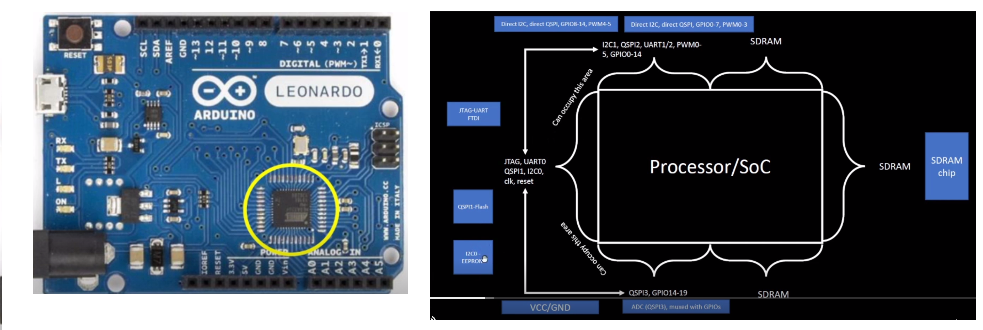

Advanced Physical Design - OpenLANE Workshop

Contents

+ #### [Day 1 - Inception of Opensource EDA](https://github.com/Anitha-Juliette/Openlane#Day1-Inception_of_Opensource_EDA)
    +  ##### [Talk with Computers](https://github.com/Anitha-Juliette/Openlane#Talk_with_Computers)
    +  ##### 

### Day 1 - Inception of Opensource EDA
#### I. TALK WITH COMPUTERS
**_1. Chip Overview_**
* Chip on a board with its Peripherals

* Package and Chip inside Package

* Deep inside the Chip

**_2. RISC_V Architecture_**
* C program -->converted to RISC-V assembly language program --> converted to machine language(binary) code --> run on RISC architecture(layout)
* Inbetween the RISC-V architecture specifications and Layout, RTL is sandwiched
* RTL implements the RISC-V architecture specifications and generates Layout

**_3. Software Applications to Hardware_**
* Typical flow from software app to hardware

* Flow illustrated with *Clock Timer* app

* Abstract interface

* Detailed flow

#### II. SoC DESIGN AND OPENLANE
**_1. Components of Open Source digital ASIC design_**
* Components
   - RTL IP's
   - EDA Tools
   - PDK's(Process Design Kits)

* In *Age of Gods*, design industry and Technology(Manufacturing) were closely related. 
* Lynn Convay and Carver Mead emphasized seperation of both design and technology industries; proposed *structured* design methodology based on Lambda rules; emerging of *Pure Play* and *efabless* companies
* Collection of files to model a fabrication process for EDA tools to design an IC
   - Process Design rules : DRC, LVS, PEX
   - Device Models
   - Digital Standard Libraries
   - I/O libraries

