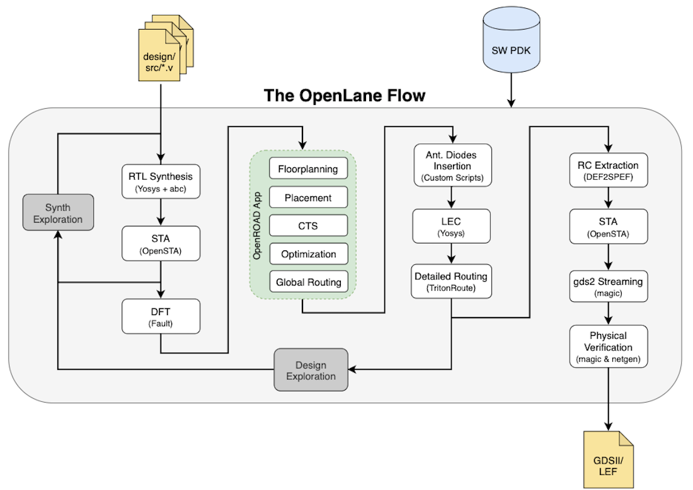

Advanced Physical Design - OpenLANE Workshop

&nbsp;[1. Day 1 - Inception of Opensource EDA](https://github.com/Anitha-Juliette/Openlane#1._Day1-Inception_of_Opensource_EDA)  
&nbsp;&nbsp;&nbsp;&nbsp;[1.1 Talk with Computers](https://github.com/Anitha-Juliette/Openlane#1.1_Talk_with_Computers)  
&nbsp;&nbsp;&nbsp;&nbsp;[1.2 SoC Design and Openlane](https://github.com/Anitha-Juliette/Openlane#1.2_Invoking_Openlane)  

### Day 1 - Inception of Opensource EDA
#### 1.1 TALK WITH COMPUTERS
**_Chip Overview_**
Illustrates the chip inside a board with its peripherals. Core of the chip is Foundry IP's and Macros integrated on a Die inside a Package with I/O pins  

**_RISC_V Architecture_**
* C program -->converted to RISC-V assembly language program --> converted to machine language(binary) code --> run on RISC architecture(layout)
* Inbetween the RISC-V architecture specifications and Layout, RTL is sandwiched
* RTL implements the RISC-V architecture specifications and generates Layout

**_Software Applications to Hardware_**
* Abstract interface

#### **1.2 SoC DESIGN AND OPENLANE**
**_Components of Open Source digital ASIC design_**
* Components
   - RTL IP's
   - EDA Tools
   - PDK's(Process Design Kits)
* In *Age of Gods*, design industry and Technology(Manufacturing) were closely related. 
* Lynn Convay and Carver Mead emphasized seperation of both design and technology industries; proposed *structured* design methodology based on Lambda rules; emerging of *Pure Play* and *efabless* companies
* First ever Open Source PDK : Skywater 130nm
* Collection of files to model a fabrication process for EDA tools to design an IC
   - Process Design rules : DRC, LVS, PEX
   - Device Models
   - Digital Standard Libraries
   - I/O libraries
 **_ASIC Flow Objective : RTL to GDSII (Automated PnR and/or Physical Implementation)_**
 * Simplified RTL2GDSII design flow
 

 * Step 1 : Synthesis
 Takes RTL file as input and produces a synthesised netlist using Yosys and abc
 * Step2 : Floor and Power planning
    - Foor Planning
      - Chip Floor planning
      - Macro Floor planning
      - Power planning : Uses upper metal layers rather than lower metal layers
 
 * Step 3 : Placement - Macros will place cells(gate level netlist) onto virtual rows. The cells should be placed close so as to ensure proer routing
    - Global placements : 
   - Detailed placements :
* Step 4 : Clock Tree Synthesis
Creates a Clock distribution network to distribute Clock with minimum skew to all sequential elements
* Step 5 : Routing
  - Implement the Interconnect using available metal layers
  - Metal Tracks form Routing grid that is large
  - Divide and Conquer approach
    - Global routing : generates routing guides(Fine grain grids)
    - Deatiled routing : uses the routing guides to implement the actual wiring(Coarse grain Grids)
 * Step 6 : Sign off/Layout
  - Physical verification(DRC & LVS)
  - STA
    
 **_Open Source ASIC Flow with Openlane and Strive Chipsets_**
 * Openlane : Open Source Flow for a *True* open source Tapeout experiment
 * efabless has a family of Soc's calles as Strive( Open PDK, Open EDA, Open RTL); SoC family
 * Main goal of Openlane ASIC is *Clean* GDSII with no human interventions; No LVS or DRC or Timing violations
 * Openlane is tuned for Skywater 130nm PDK
 * Openlane Operation
   - Autonomous : Push button approach
   - Interactive : allows to execute commands and experiment
 * Openlane Design Space exploration : Finds the best set of flow configurations
 * Openlane Design examples : 43 design examples with best configurations
    
 **_Openlane detailed ASIC Flow_**
  *
  * Integrated tools of OpenLane 
    - OpenRoad
    - magic VLSI layout Tool
    - K Layout
    - Fault
    - Yosys
    - Qflow
    - ABC
  * RTL Synthesis : RTL is fed to *Yosys* with design constraints
     - Synthesis exploartion
     - Design exploartion : sweep across various configurations and obtain the best one; Openlane regression testing run on 70 designs and obtained the best
  * DFT : Uses *Fault* for Testing ; Optional
  * Physical Implementation/ Automated PnR(Place and Route) : use *OpenRoad* tool
  * LEC(Logic Equivalence Check): Compares *netlist obtained after optimization during Physical implementation* with *Gate level netlist* obtained after RTL synthesis : Uses         *Yosys* tool
  * Dealing with Antenna Rules violation :
    - Fabricated metal wire segment(long) can act as antenna -> collects charges and damages transistor gates during fabrication
      - Solutions :
      - Bridging
      - Add antenna diode cell to leak away charges
  * RC Extraction :  DEF2SPEF
  * Static Timing analysis
      * Open STA using OpenRoad; Output of this stage is a set of Timing parameters that can specify violations if any
  * Physiscal Signoff 
  * DRC & LVS
  * DRC and Spice extraction from Layout : Magic 
  * LVS : Magic and Netgen
**_Openlane Directory structure in detail**
* Empty Linux terminal -> own directory
* Basic Linux commands
  - cd work/tools/ --> Change directory
  - ls -ltr --> List files
  - ls -- help --> will list the linux commands
  - clear --> clear page
 * Exploring Openlane Working Directory
   - From *Desktop/work/tools$ ls -ltr*, list the files
     - All tool directories such as openlane working dir, magic, skywater etc.. will be listed
   - From *Desktop/work/tools/openlane_working_dir$ ls -ltr*, list the files
     - openlane
     - pdks
  * Exploring *pdks*
   - From *Desktop/work/tools/openlane_working_dir/pdks$ ls -ltr*, list the files
     - skywater-pdk : foundry files used for commercialized tools; not for open source tools
     - open_pdks : scripts that converts foundry pdks to be compatible with open source tools
     - sky130A : pdk that is made compatible with open source environment
   - From *Desktop/work/tools/openlane_working_dir/pdks/sky130A$ ls -ltr*, list the files
     - libs.ref : contains technology process specific files
     - libs.tech : contains files specific tools
  - From *Desktop/work/tools/openlane_working_dir/pdks/sky130A/libs.tech$ ls -ltr*, list the files
  - From *Desktop/work/tools/openlane_working_dir/pdks/sky130A/libs.ref*, list the files
  
  - From *Desktop/work/tools/openlane_working_dir/pdks/sky130A/libs.ref/sky130_fd_sc_hd$ ls -lrt*, list the files; fd--> foundry sc--> standard cell hd --> variant of pdk *high density*
    - techlef : technolgy layer information
    - lib : timing information(PVT corners)
    - much more..
  
  * Exploring *openlane*
    - From *Desktop/work/tools/openlane_working_dir/openlane$docker*, run docker and then list files
    - bash-4.25 *ls  -ltr*
    - bash-4.25 *./flow.tcl -interactive*
    - % *package require openlane 0.9* 
      
       - Exploring designs : From *Desktop/work/tools/openlane_working_dir/openlane/designs$ ls -ltr*, list the files
       - Among the various *designs* in openlane we choose *picorv32a*
       - From *Desktop/work/tools/openlane_working_dir/openlane/designs/picorv32a$ ls -ltr*, list the files
         - src : contains the verilog file of the RTL design chosen
         - config.tcl : bypasses the prviously set configurations in the openlane flow
         
       - *Desktop/work/tools/openlane_working_dir/openlane/designs/picorv32a$ less config.tcl*
         
 * Design preparation step
   - *% prep -design picorv32a* : design preparation stage : merges LEF's
    
   - AFter the design prepartion stage, execute *Desktop/work/tools/openlane_working_dir/openlane/designs/picorv32a$ less config.tcl* ; *runs* directory is created
    - *anitha@openlane-workshop-03:~/Desktop/work/tools/openlane_working_dir/openlane/designs/picorv32a/runs$ ls -ltr* creates 4 folders.
    - */Desktop/work/tools/openlane_working_dir/openlane/designs/picorv32a/runs/02-07_10-07$ ls -ltr* Open the folder that contains date. This creates the directories required for the openlane
       - cmds.logs
       - tmp
       - results
       - logs
       - reports
       - config.tcl
       -
  
  
  
  * Review files after design preparation step and run synthesis
   - *run_synthesis* : Obtain Static timing analysis and Chip area 
  
**_Steps to characterize synthesis results**
* Objectives
  - Flop ratio : (Number of D flip flops/ Total number of cells)*100 = 1613/14876 = 9.06%
  
  - To see how the results were populated in the run folder
    */Desktop/work/tools/openlane_working_dir/openlane/designs/picorv32a/runs/02-07_11-02/results$ ls -ltr*
    */Desktop/work/tools/openlane_working_dir/openlane/designs/picorv32a/runs/02-07_11-02/results/synthesis/$ ls -ltr* : Viewing this at this stage shows the synthesised netlist picorv32a.synthesis.v

    - View synthesised netlist : */Desktop/work/tools/openlane_working_dir/openlane/designs/picorv32a/runs/02-07_11-02/results/synthesis$ less picorv32a.synthesis.v* : abc has completed all mappings

    - To see how the reports were populated in the run folder
      */Desktop/work/tools/openlane_working_dir/openlane/designs/picorv32a/runs/02-07_11-02/reports$ ls -ltr*
      */Desktop/work/tools/openlane_working_dir/openlane/designs/picorv32a/runs/02-07_11-02/reports/synthesis/$ ls -ltr*
     
**_Openlane Github link_**
* efabless openlane github : detailed study in this link
### Day 2 - Floor planning

