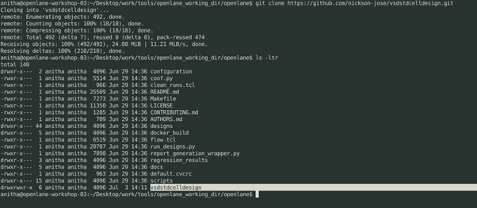
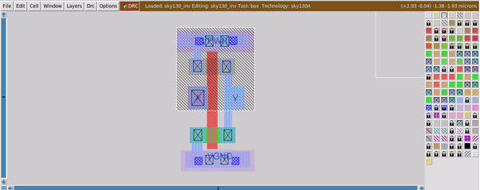
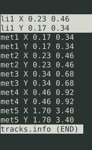
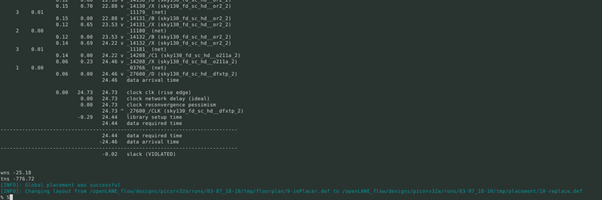

Advanced Physical Design - OpenLANE Workshop

&nbsp;[1. Day 1 - Inception of Opensource EDA](https://github.com/Anitha-Juliette/Openlane###_Day_1-Inception_of_Opensource_EDA)  
&nbsp;&nbsp;&nbsp;&nbsp;[1.1 Talk with Computers](https://github.com/Anitha-Juliette/Openlane#1.1_Talk_with_Computers)  
&nbsp;&nbsp;&nbsp;&nbsp;[1.2 SoC Design and Openlane](https://github.com/Anitha-Juliette/Openlane#1.2_Invoking_Openlane)  
&nbsp;&nbsp;&nbsp;&nbsp;[1.3 Open Source Tools familiarization](https://github.com/Anitha-Juliette/Openlane#1.3_Open_Source_Tools_familiarization)  
&nbsp;[2. Day 2 - Chip Floorplanning, Placement, Standard cell Design and Charcterization](https://github.com/Anitha-Juliette/Openlane#2.Day_2_Chip_Floorplanning,_Placement_and_Standard_cell_Design)  
&nbsp;&nbsp;&nbsp;&nbsp;[2.1 Floorplanning](https://github.com/Anitha-Juliette/Openlane#2.1_Floorplanning)  
&nbsp;&nbsp;&nbsp;&nbsp;[2.2 Placement](https://github.com/Anitha-Juliette/Openlane#2.2_Placement)  
&nbsp;&nbsp;&nbsp;&nbsp;[2.3 Standard Cell Design and Characterization](https://github.com/Anitha-Juliette/Openlane#2.3_Characterization_of_Standard_Cell_Design)  
&nbsp;[3. Day 3 - Standard Cell inverter Characterization](https://github.com/Anitha-Juliette/Openlane#3._Standard_Cell_inverter_Characterization)  
&nbsp;[4. Day 4 - Plugin Standard Cell Inverter on to the design in Openlane](https://github.com/Anitha-Juliette/Openlane#3._Standard_Cell_inverter_Characterization) 
&nbsp;&nbsp;&nbsp;&nbsp;[4.1 Spice Extraction of Standard Cell inverter through Magic](https://github.com/Anitha-Juliette/Openlane#2.1_Floorplanning)
&nbsp;&nbsp;&nbsp;&nbsp;[4.2 Inclusion of Standard Cell inverter into design](https://github.com/Anitha-Juliette/Openlane#2.1_Floorplanning)  
&nbsp;&nbsp;&nbsp;&nbsp;[4.3 Synthesis, Floorplanning and Placement of the modified design picorv32a](https://github.com/Anitha-Juliette/Openlane#2.1_Floorplanning)  

### Day 1 - Inception of Opensource EDA
#### 1.1 TALK WITH COMPUTERS
**_Chip Overview_**
Illustrates the chip inside a board with its peripherals. Core of the chip is Foundry IP's and Macros integrated on a Die inside a Package with I/O pins  

**_RISC_V Architecture_**
* C program -->converted to RISC-V assembly language program --> converted to machine language(binary) code --> run on RISC architecture(layout)
* Inbetween the RISC-V architecture specifications and Layout, RTL is sandwiched
* RTL implements the RISC-V architecture specifications and generates Layout

**_Software Applications to Hardware_**
* Abstract interface

#### **1.2 SoC DESIGN AND OPENLANE**
**_Components of Open Source digital ASIC design_**
* Components
   - RTL IP's
   - EDA Tools
   - PDK's(Process Design Kits)
* In *Age of Gods*, design industry and Technology(Manufacturing) were closely related. 
* Lynn Convay and Carver Mead emphasized seperation of both design and technology industries; proposed *structured* design methodology based on Lambda rules; emerging of *Pure Play* and *efabless* companies
* First ever Open Source PDK : Skywater 130nm
* Collection of files to model a fabrication process for EDA tools to design an IC
   - Process Design rules : DRC, LVS, PEX
   - Device Models
   - Digital Standard Libraries
   - I/O libraries
 **_ASIC Flow Objective : RTL to GDSII (Automated PnR and/or Physical Implementation)_**
 * Simplified RTL2GDSII design flow

 * Step 1 : Synthesis
 Takes RTL file as input and produces a synthesised netlist using Yosys and abc
 * Step2 : Floor and Power planning
    - Foor Planning
      - Chip Floor planning
      - Macro Floor planning
      - Power planning : Uses upper metal layers rather than lower metal layers
 * Step 3 : Placement - Macros will place cells(gate level netlist) onto virtual rows. The cells should be placed close so as to ensure proer routing
    - Global placements : 
   - Detailed placements :
* Step 4 : Clock Tree Synthesis
Creates a Clock distribution network to distribute Clock with minimum skew to all sequential elements
* Step 5 : Routing
  - Implement the Interconnect using available metal layers
  - Metal Tracks form Routing grid that is large
  - Divide and Conquer approach
    - Global routing : generates routing guides(Fine grain grids)
    - Deatiled routing : uses the routing guides to implement the actual wiring(Coarse grain Grids)
 * Step 6 : Sign off/Layout
  - Physical verification(DRC & LVS)
  - STA
    
 **_Open Source ASIC Flow with Openlane and Strive Chipsets_**
 * Openlane : Open Source Flow for a *True* open source Tapeout experiment
 * efabless has a family of Soc's calles as Strive( Open PDK, Open EDA, Open RTL); SoC family
 * Main goal of Openlane ASIC is *Clean* GDSII with no human interventions; No LVS or DRC or Timing violations
 * Openlane is tuned for Skywater 130nm PDK
 * Openlane Operation
   - Autonomous : Push button approach
   - Interactive : allows to execute commands and experiment
 * Openlane Design Space exploration : Finds the best set of flow configurations
 * Openlane Design examples : 43 design examples with best configurations
    
 **_Openlane detailed ASIC Flow_**

  * Integrated tools of OpenLane 
    - OpenRoad
    - magic VLSI layout Tool
    - K Layout
    - Fault
    - Yosys
    - Qflow
    - ABC
  * RTL Synthesis : RTL is fed to *Yosys* with design constraints
     - Synthesis exploartion
     - Design exploartion : sweep across various configurations and obtain the best one; Openlane regression testing run on 70 designs and obtained the best
  * DFT : Uses *Fault* for Testing ; Optional
  * Physical Implementation/ Automated PnR(Place and Route) : use *OpenRoad* tool
  * LEC(Logic Equivalence Check): Compares *netlist obtained after optimization during Physical implementation* with *Gate level netlist* obtained after RTL synthesis : Uses         *Yosys* tool
  * Dealing with Antenna Rules violation :
    - Fabricated metal wire segment(long) can act as antenna -> collects charges and damages transistor gates during fabrication
      - Solutions :
      - Bridging
      - Add antenna diode cell to leak away charges
  * RC Extraction :  DEF2SPEF
  * Static Timing analysis
      * Open STA using OpenRoad; Output of this stage is a set of Timing parameters that can specify violations if any
  * Physiscal Signoff 
  * DRC & LVS
  * DRC and Spice extraction from Layout : Magic 
  * LVS : Magic and Netgen  

#### **1.3 OPEN SOURCE TOOLS FAMILIARIZATION**
    
**_Openlane Directory structure in detail_**
* Basic Linux commands
  - cd work/tools/ --> Change directory
  - ls -ltr --> List files
  - ls -- help --> will list the linux commands
  - clear --> clear page
* Exploring Openlane Working Directory
   - From *Desktop/work/tools$ ls -ltr*, list the files
     - All tool directories such as openlane working dir, magic, skywater etc.. will be listed
   - From *Desktop/work/tools/openlane_working_dir$ ls -ltr*, list the files
     - openlane
     - pdks 
 * Exploring *pdks*
   - From *Desktop/work/tools/openlane_working_dir/pdks$ ls -ltr*, list the files
     - skywater-pdk : foundry files used for commercialized tools; not for open source tools
     - open_pdks : scripts that converts foundry pdks to be compatible with open source tools
     - sky130A : pdk that is made compatible with open source environment
   - From *Desktop/work/tools/openlane_working_dir/pdks/sky130A$ ls -ltr*, list the files
     - libs.ref : contains technology process specific files
     - libs.tech : contains files specific tools
     - From *Desktop/work/tools/openlane_working_dir/pdks/sky130A/libs.tech$ ls -ltr*, list the files
     - From *Desktop/work/tools/openlane_working_dir/pdks/sky130A/libs.ref*, list the files

   
  - From *Desktop/work/tools/openlane_working_dir/pdks/sky130A/libs.ref/sky130_fd_sc_hd$ ls -lrt*, list the files; fd--> foundry sc--> standard cell hd --> variant of pdk *high density*
    - techlef : technolgy layer information
    - lib : timing information(PVT corners)

   
 * Exploring *openlane*
   - Run docker
   <pre><code>Desktop/work/tools/openlane_working_dir/openlane$docker
   </code></pre>
   
   - Step by step execution in openlane using interactive mode
   <pre><code>./flow.tcl -interactive
   </code></pre>
   
   - Setting up package
   <pre><code>package require openlane 0.9
   </code></pre>     
   

   
   
    - Exploring designs : From *Desktop/work/tools/openlane_working_dir/openlane/designs$ ls -ltr*, list the files
       - Among the various *designs* in openlane we choose *picorv32a* 
   
     <pre><code>Desktop/work/tools/openlane_working_dir/openlane/designs/picorv32a$ ls -ltr
     </code></pre>
     -src : contains the verilog file of the RTL design chosen
     -config.tcl : bypasses the prviously set configurations in the openlane flow         

   
   - Viewing the config.tcl  
     <pre><code>Desktop/work/tools/openlane_working_dir/openlane/designs/picorv32a$ less config.tcl
     </code></pre>
            

 * Design preparation step
   - merges LEF's
   <pre><code>% prep -design picorv32a
   </code></pre>

   
   - After the design preparation stage, *runs* directory is created
  <pre><code>anitha@openlane-workshop-03:~/Desktop/work/tools/openlane_working_dir/openlane/designs/picorv32a/runs$ ls -ltr*
  </code></pre> 
  - Open the folder that contains date. This creates the directories required for the openlane
  <pre><code>anitha@openlane-workshop-03:~/Desktop/work/tools/openlane_working_dir/openlane/designs/picorv32a/runs$ ls -ltr*
  </code></pre> 
       - cmds.logs
       - tmp
       - results
       - logs
       - reports
       - config.tcl

  
 * Review files after design preparation step and run synthesis
   <pre><code>run_synthesis
   </code></pre>
   - Obtain Static timing analysis and Chip area 

**_Steps to characterize synthesis results**
* Objectives
  - Flop ratio : (Number of D flip flops/ Total number of cells)*100 = 1613/14876 = 9.06%

   
  - To see how the results were populated in the run folder
 <pre><code>/Desktop/work/tools/openlane_working_dir/openlane/designs/picorv32a/runs/02-07_11-02/results/synthesis/$ ls -ltr
 </code></pre>
 
   -Viewing this at this stage shows the synthesised netlist picorv32a.synthesis.v

   
    -View synthesised netlist : abc has completed all mappings
 <pre><code>/Desktop/work/tools/openlane_working_dir/openlane/designs/picorv32a/runs/02-07_11-02/results/synthesis$ less picorv32a.synthesis.v
 </code></pre>  

   
    - To see how the reports were populated in the run folder
 <pre><code>/Desktop/work/tools/openlane_working_dir/openlane/designs/picorv32a/runs/02-07_11-02/reports/synthesis/$ ls -ltr
 </code></pre>    

   
**_Openlane Github link_**
* efabless openlane github : detailed study in this link
   https://github.com/The-OpenROAD-Project/OpenLane
   
### Day 2 - CHIP FLOORPLANNING, PLACEMENT , STANDARD CELL DESIGN AND CHARACTERIZATION
#### 2.1 FLOORPLANNING
   * Setting Die area
   * Setting Core area(Macro and row cells)
   * Specification of Aspect ratio
   * Optimizaation of Utilization factor
   * Places Preplaced cells(Macros) I/O 
   * Places decoupling capacitors
   * Power distribution Networks(In Openlane flow, PDN is executed before Routing)
   * Placement of pin locations 
   
**_Viewing files before Floorplan run_**
   <pre><code>anitha@openlane-workshop-03:~/Desktop/work/tools/openlane_working_dir/openlane/configuration$ ls –ltr
   </code></pre>
   

   
   
   * README.md : 
   <pre><code>03:~/Desktop/work/tools/openlane_working_dir/openlane/configuration$ less README.md
   </code></pre>
   
   * tcl files : Contains the details of Variables required for each stage(default values). Variables are the switches of the openlane flow. The order of precedence of the .tcl files is given below :
     - sky130A_sky130_fd_sc_hd_config.tcl
     - config.tcl
     - floorplan.tcl
   <pre><code>03:~/Desktop/work/tools/openlane_working_dir/openlane/configuration$ less floorplan.tcl
   </code></pre>
   
   

   
   
**_Run Floorplan_**
   * It has to be run through docker
   <pre><code>03:% run_floorplan
   </code></pre>
   

   
   
 **_Review output after Floorplan run_**
   * picorv32a.floorplan.def is created. 
   <pre><code>003:~/Desktop/work/tools/openlane_working_dir/openlane/designs/picorv32a/runs/02-07_15-58/results/floorplan$ less picorv32a.floorplan.def
   </code></pre>
   

   
   
   * picorv32a.floorplan.def gives the Die area
   

   

   * Actual layout after floorplan : 
     - invoked through magic by passing the files sky130A.tech, merged.lef and picorv32a.floorplan.def 
   <pre><code>anitha@openlane-workshop-03:~/Desktop/work/tools/openlane_working_dir/openlane/designs/picorv32a/runs/02-07_15-58/results/floorplan$ magic -T /Desktop/work/tools/openlane_working_dir/pdks/sky130A/libs.tech/magic/sky130A.tech lef read ../../tmp/merged.lef def picorv32a.floorplan.def &
   </code></pre>  
   sky130A.tech : Technology file invoked from Magic  
   merged.lef   : Created from Preperation stage  
   picorv32a.floorplan.def: Created from Floorplan stage  
   -T : technology  
   & : prompt to return back after Magic invocation
   

   
   
    - By typing What in tkcon window, the selected mask layerin the cell can be viewed
   

   
      
#### 2.2 PLACEMENT
      
   * Binds netlist with physical cells
   * Library has various flavours of cells
   * Netlist is placed onto the floorplan
   * Placement is done unde following stages
     - Initial Placement of design
     - Optimized placement using wire length and capacitance. Repeaters have to be placed for maintaining Signal integrity
     - Final placement optimization
   * Congestion aware placement using RePIAce
     - Global placement(coarse placement; no legalization)
     - Detailed placement(legalization)
   * Placement ensures that standard cells are placed in rows
   

   
      
   <pre><code>%run_placement
   </code></pre>
   
   - Performs global placement
   - Creates picorv32a.placement.def 
   
   * It can be invoked as Layout in Magic using sky130A.tech, merged.lef and picorv32a.placement.def  
   sky130A.tech : Technology file invoked from Magic  
   merged.lef   : Created from Preperation stage  
   picorv32a.floorplan.def: Created from Floorplan stage  
   <pre><code>03:~/Desktop/work/tools/openlane_working_dir/openlane/designs/picorv32a/runs/02-07_15-58/results/placement$ magic -T /home/anitha/Desktop/work/tools/openlane_working_dir/pdks/sky130A/libs.tech/magic/sky130A.tech lef read ../../tmp/merged.lef def picorv32a.placement.def &
   </code></pre>
   

   
   

   
      
#### **2.3 STANDARD CELL DESIGN AND CHARACTERIZATION**
* Standard cell design involves the creation of Layout(GDSII) of  cells such as inverter, buffer, gates, which is devloped into IP core design  
* Circuit and Layout design is done using Magic and Guna taking PDKs, DRC and LVS rules, SPICE models, library & user-defined specs as inputs  
* Outputs are CDL (Circuit Description Language), GDSII, LEF(Library Exchange Format), Spice extracted netlist, timing, noise, power libs.  

 ### DAY 3 - STANDARD CLL INVERTER CHARACTERIZATION
* In this workshop, a Standard cell inverter layout from Github is imported into Openlane environment to characterize the cell(Timing, Power and Noise analysis  
* Clone the standard cell inverter layout from github into openlane environment:
   <pre><code>
   anitha@openlane-workshop-03:~/Desktop/work/tools/openlane_working_dir/openlane$ git clone https://github.com/nickson-jose/vsdstdcelldesign.git
   </code></pre>
   

   
   

   
      
* Copy sky130A.tech to vsdstdcelldesign and invoke sky130_inv.mag the layout through Magic
  

  
     
  <pre><code>03:~/Desktop/work/tools/openlane_working_dir/openlane/vsdstdcelldesign$ magic -T sky130A.tech sky130_inv.mag &
  </code></pre>
  

  
   
 * Extraction of Spice Netlist :
   - In tkcon2.3 , in vsdstdcelldesign directory  
   <pre><code>Extract all
   </code></pre>  
   - Sky130_inv.ext is created
  
  

  
   
   - In Tkcon,
  <pre><code>Ext2spice cthresh 0 rthresh 0  
             Ext2spice
  </code></pre>
    - Sky130_inv.spice is created from Sky130_inv.ext
  
  

  
   
   - View the Spice file with the command
  <pre><code>vim sky13_inv.ext 
  </code></pre>
  

  
  

  

   
 * Modification of Spice file based on Model files  :
   - MOS models are identified in the .lib files as below
  

  
  

  
     
   - The modified Sky130_inv.spice file 
  

  
 
 * Running on ngspice
  <pre><code>03:~/Desktop/work/tools/openlane_working_dir/openlane/vsdstdcelldesign$ ngspice sky130_inv.spice
  </code></pre>
  

  
 
 * Obtaining the Transient response
  <pre><code>ngspice 1 -> plot Y vs time A ( plot Y as a function of time by sweeping A)
  </code></pre>
  

  
 
 * Calculation of Delays
   - Rise time(o/p 20% to 80%)
   - Fall transit(o/p 80% to 20%)
   - Cell rise delay or Rise Prog delay( 50% of input fall to 50% of output rise)
   - Cell fall delay or fall Prog delay( 50% of input rise to 50% of output fall)
   - As an example. Calculating cell rise delay: 
    50% of 3.3 = 1.65v; Zoom into the level nd obtain the time values
    Cell rise delay = 2.17 – 2.15 = 0.02ns
   
  

  
  

  
 
 ### DAY 4 - PLUGIN STANDARD CELL INVERTER ON TO THE DESIGN IN OPENLANE
 #### 4.1 EXTRACTION OF SPICE NETLIST OF STANDARD CELL INVERTER THROUGH MAGIC
 * Steps to convert Grid info(magic) into Trackinfo(pdk in openlane)
     - Only with tracks, PnR can route
     - Converge grid with track value
 <pre><code>anitha@openlane-workshop-03:~/Desktop/work/tools/openlane_working_dir/pdks/sky130A/libs.tech/openlane/sky130_fd_sc_hd$ less tracks.info
 </code></pre>
 

 
 

 
    
 * In Tkcon 
 <pre><code>% grid 0.46um 0.34um 0.23um 0.17um
 </code></pre>
 

 
 

 
    
 * I/O ports should lie at the intersection of vertical and horizontal grids
 

 
 * Save the matched Grid-Track file in Tkcon
 <pre><code>% save sky130_vsdinv.mag
 </code></pre>
 

 
 
 * Invoke the sky130_vsdinv.mag in Magic 
<pre><code>03:~/Desktop/work/tools/openlane_working_dir/openlane/vsdstdcelldesign$ magic -T sky130A.tech sky130_vsdinv.mag
</code></pre>
* In tkcon, write the LEF file into vsdstdcell and view it.
<pre><code>% lef write
</code></pre>

   
#### 4.2 INCLUSION OF STANDARD CELL INVERTER INTO DESIGN 
* Insertion of LEF file into the Source files of Design picorv32a
<pre><code>anitha@openlane-workshop-03:~/Desktop/work/tools/openlane_working_dir/openlane/vsdstdcelldesign$ cp sky130_vsdinv.lef /home/anitha/Desktop/work/tools/openlane_working_dir/openlane/designs/picorv32a/src
</code></pre>

* Copy the library file of the standard cell library to the src folder of picorv32a

<pre><code>03:~/Desktop/work/tools/openlane_working_dir/openlane/vsdstdcelldesign/libs$ cp sky130_fd_sc_hd__typical.lib /home/anitha/Desktop/work/tools/openlane_working_dir/openlane/designs/picorv32a/src
</code></pre>

* Modify the config.tcl by including the variables below:
  - LIB_SYNTH : For abc analysis(maps RTL to standard cells)
  - LIB_MIN,LIB_MAX,LIB_TYPICAL : For STA Analysis
  - Extra lef
<pre><code>anitha@openlane-workshop-03:~/Desktop/work/tools/openlane_working_dir/openlane/designs/picorv32a$ vim config.tcl
</code></pre>

* merged.lef to be created for the modified file
<pre><code>% prep -design picorv32a -tag 03-07_18-10 –overwrite (run should be the latest one)
           % set lefs [glob $::env(DESIGN_DIR)/src/*lef]
           % add_lefs -src $lefs
</code></pre>

    
#### 4.3 SYNTHESIS, FLOORPLANNING AND PLACEMENT OF MODIFIED DESIGN picorv32a
* Synthesis
  - Run Synthesis on the modified design file 
<pre><code>% run_synthesis
</code></pre>

   
* Floorplan
<pre><code>% init_floorplan
</code></pre>

   
* I/O Placement
<pre><code>% place_io
</code></pre>

   
* Global Placement
<pre><code>% global_placement_or	
</code></pre>

* Detailed Placement
<pre><code>% detailed_placement
</code></pre>

* Placing Decoupling Capacitors
<pre><code>% tap_decap_or
</code></pre>

* Detailed Placement
<pre><code>% detailed_placement
</code></pre>

* Include the picorv32a.placement.def file into magic 
<pre><code>anitha@openlane-workshop-03:~/Desktop/work/tools/openlane_working_dir/openlane/designs/picorv32a/runs/03-07_18-10/results/placement$ magic -T /home/anitha/Desktop/work/tools/openlane_working_dir/pdks/sky130A/libs.tech/magic/sky130A.tech lef read ../../tmp/merged.lef def picorv32a.placement.def
</code></pre>

   
* The standard cell inverter sky130_vsdinv is founded to be included in the design

 
* In Tkcon, type expand to the find the detailed layout of the newly included inverter

   

   

   

   

    

     

   
      
   
      
   

       - 
      

   
   
    
   

